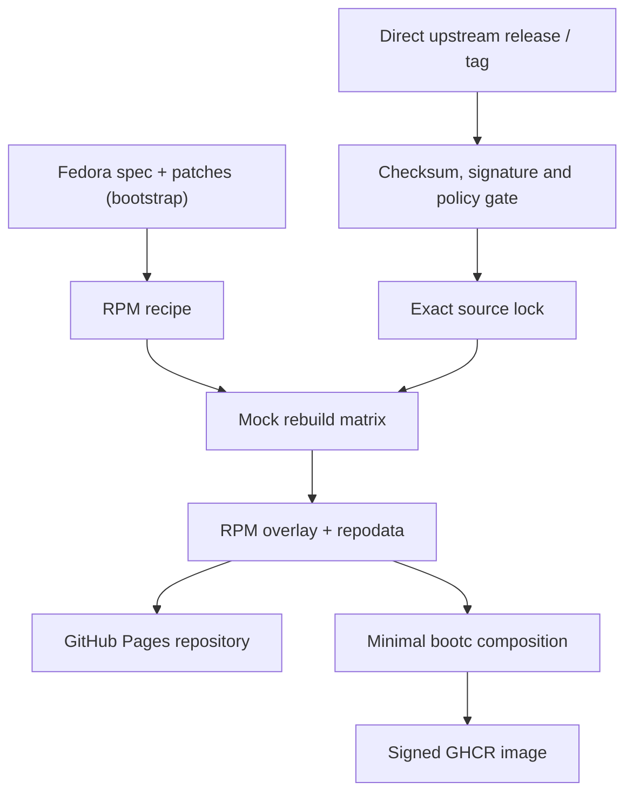

# Architecture

Fedora Rawhide supplies a temporary compatibility build root and initial RPM
recipes, never an update source or runtime package repository for consumer
images. Every RPM source payload is fetched from its configured upstream and
must pass the verification gate before it can reach Mock. The factory builds a
manifest-defined closure in shards on GitHub-hosted runners.
