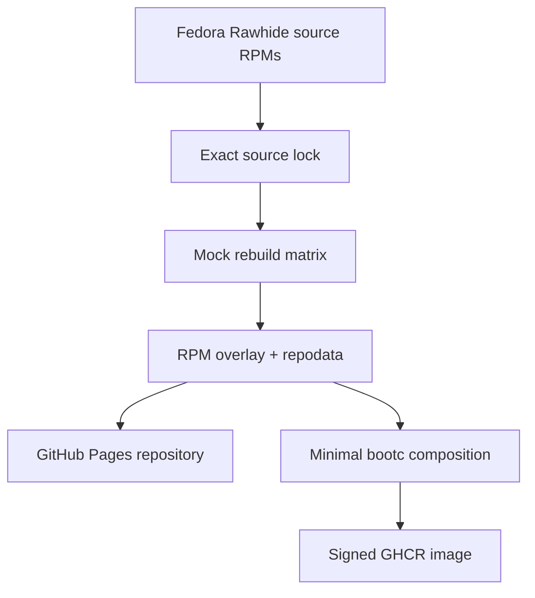

# Architecture

Fedora Rawhide is an upstream source, never a runtime package repository for
consumer images. The factory builds a manifest-defined closure in shards on
GitHub-hosted runners; expanding to all Rawhide packages is a capacity project,
not a change in the trust model.
